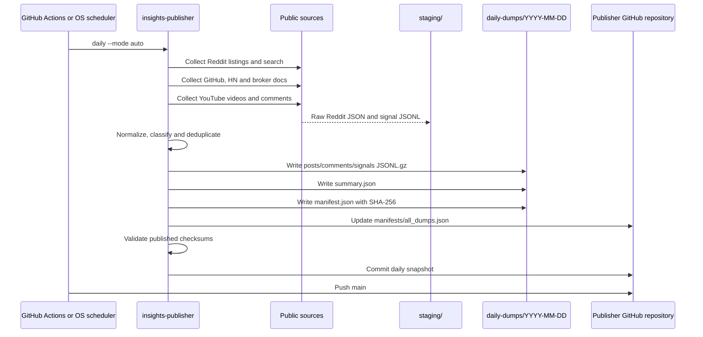
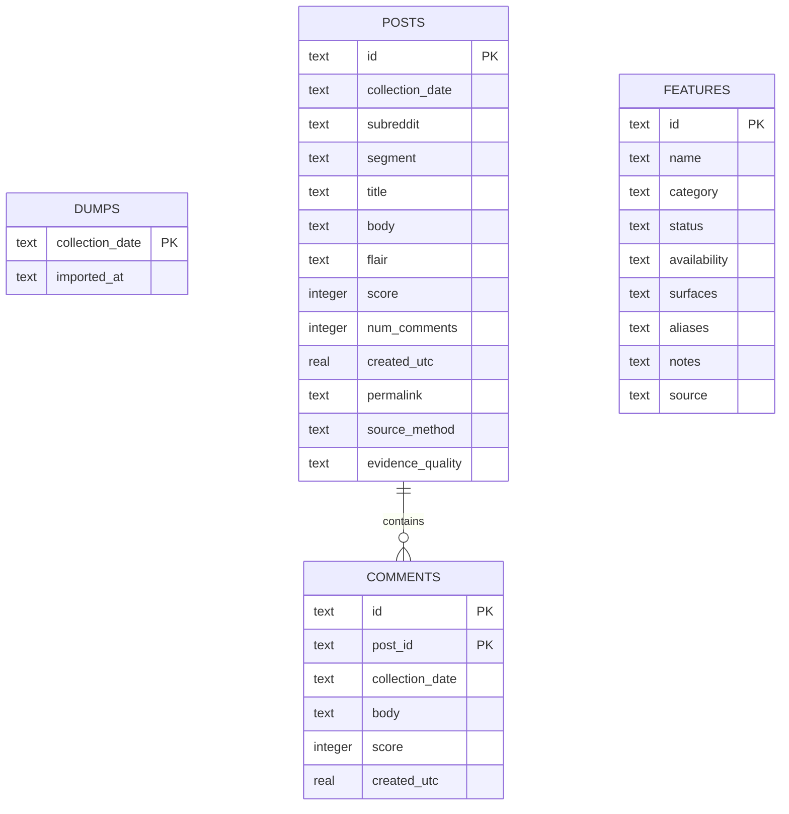
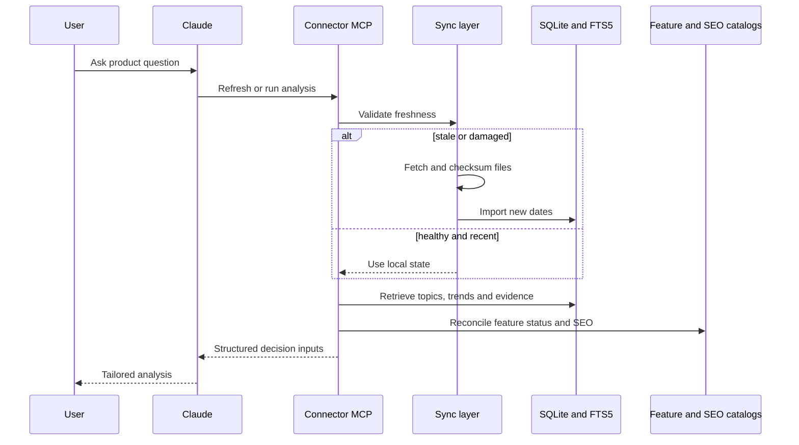

# Reddit Product Insights — As-Built Architecture

This document describes the system implemented across two public repositories:

- [`reddit-scraper-github-publisher`](https://github.com/subothsundar123/reddit-scraper-github-publisher) — collection, normalization, packaging and publication.
- [`reddit-insights-claude-agent`](https://github.com/subothsundar123/reddit-insights-claude-agent) — incremental synchronization, local evidence storage, deterministic analysis and Claude MCP integration.

It is written for developers who need to operate, debug or extend the project. Proposed improvements are separated from existing behavior.

## 1. Purpose

The system turns public product conversations into reusable evidence for Nubra product and marketing analysis. It is designed to answer:

- What are retail traders and API/algo users discussing?
- Which requests repeat, and which are isolated?
- Does Nubra already provide the requested capability?
- Which upcoming features have market and competitor support?
- What should be built, improved, explained or promoted?
- Which SEO topics connect search demand with Nubra capabilities?

Evidence collection is separated from the language model. The publisher creates versioned facts and metadata; Claude performs question-specific synthesis at query time.

## 2. Component architecture

```mermaid
flowchart LR
    subgraph Sources["Public evidence sources"]
        Reddit["Reddit"]
        YouTube["YouTube Data API"]
        GitHub["GitHub Search API"]
        HN["Hacker News Algolia API"]
        Docs["Broker and product pages"]
        Manual["Manual public research"]
    end

    subgraph Publisher["Publisher repository"]
        QueryConfig["Channel and keyword configuration"]
        Collectors["Source collectors"]
        Normalizer["Normalization and classification"]
        Packager["Daily dump packager"]
        Validator["Manifest and checksum validator"]
        Catalogs["Feature and SEO catalogs"]
    end

    subgraph Distribution["GitHub distribution"]
        Dumps["Immutable dated dumps"]
        Index["Global dump index"]
        ProductCatalog["Product catalog"]
        SeoCatalog["SEO catalog"]
    end

    subgraph Connector["Connector and local runtime"]
        Sync["Incremental sync and repair"]
        LocalFiles["Verified local files"]
        SQLite["SQLite evidence store"]
        FTS["FTS5 evidence index"]
        Engine["Deterministic intelligence engine"]
        MCP["MCP tools and prompts"]
    end

    subgraph Clients["User surfaces"]
        Desktop["Claude Desktop"]
        Code["Claude Code"]
        CLI["Local CLI"]
    end

    Sources --> Collectors
    QueryConfig --> Collectors
    Collectors --> Normalizer --> Packager --> Validator
    Catalogs --> Validator
    Validator --> Dumps
    Validator --> Index
    Catalogs --> ProductCatalog
    Catalogs --> SeoCatalog
    Dumps --> Sync
    Index --> Sync
    ProductCatalog --> Sync
    SeoCatalog --> Sync
    Sync --> LocalFiles --> SQLite --> FTS
    SQLite --> Engine
    FTS --> Engine
    Engine --> MCP
    MCP --> Desktop
    MCP --> Code
    Engine --> CLI
```



## 3. Repository boundaries

| Responsibility | Publisher | Connector |
|---|---:|---:|
| Source credentials and collection | Yes | No |
| Keyword and channel configuration | Yes | No |
| Public text normalization | Yes | No |
| Privacy hashing | Yes | No |
| Daily gzip dump generation | Yes | No |
| SHA-256 manifests | Creates | Verifies |
| Feature and SEO catalogs | Canonical owner | Pulls verified copies |
| GitHub distribution | Publishes | Reads |
| Local incremental synchronization | No | Yes |
| SQLite and FTS5 | No | Yes |
| Deterministic product analysis | No | Yes |
| MCP tools and prompts | No | Yes |
| Claude Code slash commands | No | Yes |

The connector never needs collection credentials. It reads the data repository and keeps a separate local evidence store.

## 4. Daily publication flow



Manual enrichment is a second pass:

```text
public manual research
→ staging/manual_research_YYYY-MM-DD.jsonl
→ insights-publisher add-manual-research
→ ID-based merge into signals.jsonl.gz
→ regenerate summary and manifest
→ validate, commit and push
```

## 5. Collection layer

### 5.1 Source adapters

Collectors live in `reddit-scraper-github-publisher/src/insights_publisher/cli.py`.

| Collector | Function | Access | Output |
|---|---|---|---|
| Reddit official | `collect_api` | PRAW and credentials | Grouped post/comment JSON |
| Reddit fallback | `collect_public` | Public Reddit JSON | Grouped post JSON |
| GitHub | `collect_github_signals` | Search API, optional token | Normalized signals |
| Hacker News | `collect_hacker_news_signals` | Algolia API | Normalized signals |
| Broker docs | `collect_broker_doc_signals` | Public HTTP pages | Normalized signals |
| YouTube | `collect_youtube_signals` | YouTube Data API | Video/comment signals |
| Manual enrichment | `add_manual_research` | Public research JSONL | Normalized signals |

When Reddit credentials are absent, the public JSON fallback is used. Reddit may return HTTP 403/429; current operational fallback is indexed public Reddit research added through manual enrichment.

### 5.2 Configuration

| File | Purpose |
|---|---|
| `config/channels.json` | Subreddits, listing sorts, Reddit searches and limits |
| `config/public_signal_sources.json` | GitHub, HN, broker-doc and YouTube sources |
| `config/youtube_keywords.json` | Retail/API partitions, limits and SEO seeds |
| `config/retail_feature_keywords.json` | Nubra brand sweep, personas and feature queries |
| `manual-research/source-query-bank.json` | Human/agent public research queries |
| `marketing-keywords/current.json` | SEO catalog and compact daily search seeds |

### 5.3 YouTube query planner

The YouTube collector:

1. Selects ordinary retail and API queries with round-robin bucket coverage.
2. Pins the broad Nubra brand sweep.
3. Rotates feature-specific retail queries by collection date.
4. Adds compact SEO search seeds.
5. Deduplicates identical `(partition, keyword)` pairs.

The current plan produces 50 retail and 13 API/algo searches in a full run. Limits are configurable.

Stored YouTube data is text-only:

- title, description, channel and publication date;
- views, likes and comment count;
- views/day, comments/day and engagement rate;
- relevant and recent top-level comments;
- comment intent, feature, persona and competitor summaries.

Videos, thumbnails and media are not downloaded.

### 5.4 Nubra brand sweep

The exact query `Nubra` is filtered to trading/market context to reduce unrelated place-name results. Specific pinned searches include:

- Nubra trading;
- Nubra stock broker;
- Nubra trading app review;
- Nubra app features and complaints.

### 5.5 Credentials

Credentials are environment variables or GitHub Actions secrets, never repository files.

| Variable | Purpose |
|---|---|
| `YOUTUBE_API_KEY` | YouTube collector |
| `REDDIT_CLIENT_ID` | Reddit official API |
| `REDDIT_CLIENT_SECRET` | Reddit official API |
| `REDDIT_USERNAME` | Optional Reddit script authentication |
| `REDDIT_PASSWORD` | Optional Reddit script authentication |
| `REDDIT_USER_AGENT` | Reddit collectors |
| `GITHUB_TOKEN` | Optional GitHub allowance |

## 6. Normalization and classification

### 6.1 Public signal contract

The canonical contract is `schemas/public-signal.schema.json`.

| Field | Meaning |
|---|---|
| `id` | Stable source-derived signal ID |
| `source` | Source family |
| `channel` | Subreddit, channel, repository or page |
| `item_type` | Post, issue, video thread, docs page, etc. |
| `collected_on` | Dump date |
| `created_at` | Source publication time when available |
| `title`, `body` | Public evidence text |
| `url` | Original evidence link |
| `author_hash` | One-way pseudonym |
| `engagement` | Source-native metrics |
| `tags` | Topic tags |
| `feature_ids` | Matched Nubra feature IDs |
| `personas` | Matched trader personas |
| `signal_type` | Request, pain, question, feedback, comparison or general |
| `segment` | `retail` or `api_algo` |
| `competitors` | Recognized products/brokers |
| `evidence_quality` | Collection provenance |
| `source_method` | Concrete adapter/method |

### 6.2 Identity and deduplication

Signal IDs are derived from:

```text
source + external_id + URL + title
```

The publisher deduplicates by ID within a run. Manual enrichment uses the same ID, so a replacement does not inflate demand.

### 6.3 Classification

Classification is deterministic and phrase-based:

- `TOPIC_TAGS` maps text to product topics.
- `COMPETITOR_ALIASES` maps aliases to canonical competitors.
- `retail-upcoming-features.json` supplies feature names and aliases.
- `retail_feature_keywords.json` supplies persona aliases.
- request/pain/question/feedback phrases assign `signal_type`.
- API terms assign `api_algo`; other items default to `retail`.

This is explainable and inexpensive, but heuristic rather than ML-based.

### 6.4 Privacy

- Direct usernames are replaced by a SHA-256-derived pseudonym.
- Deleted/removed authors become null.
- Private groups, login-only content and CAPTCHA bypasses are out of scope.
- Manual research must not retain personal contact information.

## 7. Daily dump contract

```text
daily-dumps/YYYY-MM-DD/
├── posts.jsonl.gz
├── comments.jsonl.gz
├── signals.jsonl.gz
├── summary.json
└── manifest.json
```

| File | Role |
|---|---|
| `posts.jsonl.gz` | Normalized Reddit-style posts |
| `comments.jsonl.gz` | Comments linked to `post_id` |
| `signals.jsonl.gz` | Cross-channel public signals |
| `summary.json` | Counts by source, method, quality and engagement |
| `manifest.json` | Paths, byte sizes and SHA-256 hashes |

`manifests/all_dumps.json` is the ordered global index used by the connector.

Supporting catalogs:

```text
product-catalog/
├── current.json
├── manifest.json
├── retail-upcoming-features.json
└── history/

marketing-keywords/
├── current.json
├── manifest.json
├── README.md
└── views/
```

Feature status semantics:

- `available`;
- `upcoming`;
- `partial`;
- `internal_unverified`;
- `not_available`.

Upcoming/internal items must not be presented as generally available.

## 8. Publication and schedules

GitHub Actions runs at `30 20 * * *`, equivalent to 02:00 Asia/Kolkata. It checks out the publisher, installs Python 3.12, runs `insights-publisher daily --mode auto`, and pushes the generated commit. The publisher labels snapshots using `INSIGHTS_TIMEZONE` (default `Asia/Kolkata`) rather than the GitHub runner's UTC calendar date, so an early-morning India run cannot overwrite the previous day's snapshot.

Windows publisher scheduling uses `scripts/install_daily_task.ps1`, with `StartWhenAvailable`.

Important: `insights-publisher daily` creates a local commit even when `--push` is omitted. The flag controls pushing, not commit creation.

## 9. Connector synchronization

### 9.1 Data source selection

The connector reads:

- `INSIGHTS_DATA_REPO_PATH` for local development; or
- `INSIGHTS_DATA_REPO_URL` for remote operation.

`Source.refresh` uses:

1. local path when configured;
2. filtered Git clone/fetch when Git is available;
3. public GitHub branch ZIP fallback when Git is unavailable or initialization fails.

Private repositories require Git authentication. ZIP fallback supports public GitHub HTTPS repositories.

### 9.2 Local data root

Default:

```text
~/Documents/Nubra Product Insights
```

```text
Nubra Product Insights/
├── .data-repo-cache/
├── .data-repo-zip/
├── raw/daily-dumps/
├── catalog/current.json
├── marketing-keywords/current.json
├── cache/
├── insights.sqlite3
└── sync-state.json
```

### 9.3 Freshness and repair

Default freshness is six hours: `INSIGHTS_SYNC_MAX_AGE_HOURS=6`.

Sync:

1. validates local state and files;
2. uses healthy recent files immediately;
3. refreshes stale or damaged state;
4. pulls only unrecorded dump dates;
5. verifies every manifest checksum;
6. refreshes changed feature/SEO catalogs;
7. imports local files into SQLite;
8. falls back to healthy local data if remote refresh fails;
9. removes invalid state entries so partial dumps are redownloaded.

`INSIGHTS_DESKTOP_LOCAL_ONLY` controls the fast path, but stale/damaged data can self-repair when a remote is configured.

## 10. Local database

SQLite runs in WAL mode.



`evidence_fts` is an FTS5 table:

```text
kind, item_id, title, body, subreddit, collection_date
```

Cross-channel signals are imported into `posts` using:

```text
id = "sig_" + signal.id
subreddit = source + ":" + channel
```

Tags are serialized into `flair`. Source engagement is reduced to score/comment fields for deterministic analysis.

### 10.1 First-seen identity

`posts.id` is globally unique. If the same issue/video appears on multiple dates, the connector does not add another row. This prevents repeated collection from becoming repeated demand.

Tradeoff: recurring items retain first-import semantics rather than full daily metric history.

## 11. Intelligence engine

### 11.1 Evidence search

`search(query)` tokenizes input, builds an FTS5 OR expression, ranks with BM25 and returns unique evidence with URL, engagement, segment and source method.

### 11.2 Topic analysis

`analyze(days)`:

- loads evidence inside the date window;
- normalizes retail/API segment;
- matches product topics;
- calculates recurrence and engagement;
- identifies cross-topic pairs;
- maps competitor mentions;
- finds emerging unmapped topics;
- extracts representative evidence.

Technical-only topics are excluded from retail rows unless classified `api_algo`.

### 11.3 Engagement

```text
log(1 + score) + 0.6 × log(1 + comments)
```

Engagement is a prioritization signal, not a unique-user count.

### 11.4 Feature reconciliation

Catalog mapping:

| Status | Analysis classification |
|---|---|
| `available` | Awareness/adoption gap |
| `partial` | Workflow/coverage gap |
| `upcoming` | Launch readiness |
| `internal_unverified` | Needs verification |
| `not_available` | Missing/discovery candidate |

### 11.5 Opportunity scoring

| Component | Maximum |
|---|---:|
| Demand recurrence | 35 |
| Engagement | 20 |
| Cross-segment relevance | 10 |
| Cross-topic support | 10 |
| Competitor context | 10 |
| Nubra relevance | 15 |

Bands are High (70+), Medium (45–69) and Watch (below 45).

### 11.6 Trends and cache

`detect_changes` compares recent daily rate with the preceding period and marks topics New, Rising, Stable or Declining.

Analysis cache fingerprint includes:

- cache schema;
- requested days;
- synchronized dump dates;
- catalog checksum;
- connector version.

## 12. MCP layer

`src/reddit_insights_agent/server.py` exposes stdio MCP server `reddit-product-insights`.

### Tools

| Tool | Responsibility |
|---|---|
| `run_daily_insights` | Full structured analysis |
| `ask_product_insights` | Question-specific decision inputs |
| `get_connector_status` | Version, counts and health |
| `refresh_insights_data` | Force refresh |
| `search_evidence` | FTS evidence lookup |
| `get_nubra_feature` | Feature lookup |
| `get_nubra_app_context` | App-surface context |
| `get_retail_upcoming_features` | Retail upcoming set |
| `get_seo_keywords` | Filtered SEO query |
| `compare_insight_periods` | Period comparison |

### Prompts

Prompts orchestrate tools and answer structure:

- `daily_product_insights`;
- `new_feature_analysis`;
- `retail_feature_research`;
- `seo_insights`;
- `youtube_insights`;
- `feature_requests`;
- `competitors`;
- `roadmap`.

Prompts do not contain evidence. They retrieve current evidence and catalogs.

### Claude Code commands

`.claude/commands/*.md` includes:

```text
/daily-insights
/ask-insights
/new-feature-analysis
/seo-insights
/channel-insights
/evidence
/update-insights-data
/update-connector
```

A slash command is a Claude Code instruction layer, not a data source or MCP tool.

## 13. Query-time flow



## 14. Runtime surfaces

### Claude Desktop

Claude Desktop starts the virtual-environment Python executable with:

```text
-m reddit_insights_agent.server
```

The installer merges the connector without replacing unrelated MCP servers and backs up the configuration.

### Claude Code

`.mcp.json` declares the stdio server. `.claude/commands` supplies slash commands. The `reddit-insights` launcher opens Claude Code in the agent folder.

### CLI

```bash
python -m reddit_insights_agent.cli sync --force
python -m reddit_insights_agent.cli status --refresh
python -m reddit_insights_agent.cli daily-insights --days 30
python -m reddit_insights_agent.cli ask "What should Nubra improve?" --days 30
```

## 15. Consumer scheduling

Installers can create:

- macOS LaunchAgent with `RunAtLoad`;
- Linux persistent systemd user timer;
- Windows data-update tasks.

The Linux timer has `Persistent=true`, so missed runs execute after the system becomes available.

Publisher and connector schedules are separate:

- publisher creates shared data;
- connector pulls published data into one user’s machine.

## 16. Failure handling

| Failure | Behavior |
|---|---|
| Reddit 403/429 | Log/skip; use other sources or manual indexed research |
| Missing YouTube key | Empty YouTube staging file; continue |
| YouTube quota error | Clear runtime failure |
| GitHub rate limit | Stop GitHub query loop; retain other sources |
| Broker-doc failure | Store `collection_error` signal |
| Git missing | Public GitHub ZIP fallback |
| Git timeout | Use verified cache or ZIP initialization fallback |
| Checksum mismatch | Delete invalid file and fail/repair |
| Remote unavailable | Use healthy local data in degraded mode |
| Partial local dump | Remove state entry and redownload |
| Stale local state | Refresh after six-hour threshold |

## 17. Security boundaries

### Publisher

- owns collection API credentials;
- writes canonical dumps and catalogs;
- has GitHub contents-write permission during collection.

### Connector

- requires read-only data access;
- needs no source collection secrets;
- writes only to its local data root.

### Claude/user

- receives normalized evidence through MCP;
- retains public source URLs for verification;
- is constrained by product status definitions.

## 18. Developer setup

### Publisher

```bash
git clone https://github.com/subothsundar123/reddit-scraper-github-publisher.git
cd reddit-scraper-github-publisher
python -m venv .venv
python -m pip install -e .
python -m unittest discover -s tests -v
insights-publisher validate
```

Local collection:

```bash
insights-publisher collect-signals --date YYYY-MM-DD
insights-publisher daily --mode auto
```

Do not run `daily` on a branch where an automatic data commit is unwanted.

### Connector

```bash
git clone https://github.com/subothsundar123/reddit-insights-claude-agent.git
cd reddit-insights-claude-agent
python -m venv .venv
python -m pip install -e .
python -m unittest discover -s tests -v
```

Local development:

```bash
export INSIGHTS_DATA_REPO_PATH=/absolute/path/to/reddit-scraper-github-publisher
export INSIGHTS_LOCAL_DATA_DIR=/tmp/nubra-product-insights
python -m reddit_insights_agent.cli status --refresh
```

Use a temporary local data directory to avoid modifying production connector state.

## 19. Extension guide

### Add an automated source

1. Add source configuration under `config/`.
2. Implement `collect_<source>_signals`.
3. Return rows through `_signal`.
4. Add the collector to `collect_public_signals`.
5. Preserve stable external IDs and canonical URLs.
6. Add source-native engagement, method and quality metadata.
7. Test missing credentials, normalization and deduplication.
8. Produce and validate a test dump.
9. Confirm connector import and FTS search.
10. Enable scheduling only after validation.

### Add a retail feature

1. Add or merge it in `product-catalog/retail-upcoming-features.json`.
2. Upsert it into `product-catalog/current.json`.
3. Set explicit status and source.
4. Add user-language aliases.
5. Update catalog manifest/history.
6. Add queries in `config/retail_feature_keywords.json`.
7. Update prompts only when special reasoning is required.
8. Test lookup and upcoming-feature output.

### Add an intelligence module

1. Implement structured retrieval/aggregation in `core.py`.
2. Return JSON rather than formatted prose.
3. Expose an MCP tool if Claude needs direct access.
4. Add a prompt for repeatable report structure.
5. Add a slash command only for Claude Code discoverability.
6. Test tool logic separately from prompt wording.

## 20. Testing

Publisher tests cover dump integrity, schema, YouTube planning, Nubra sweep, classification, SEO views, upcoming-feature deduplication and manual normalization.

Connector tests cover incremental sync, self-repair, local/degraded operation, catalogs, analysis, MCP prompts and OS installers.

Required checks:

```bash
python -m unittest discover -s tests -v
insights-publisher validate
git diff --check
```

## 21. Current limitations and technical debt

1. Direct Reddit freshness needs approved credentials; public JSON may return 403.
2. Twitter/X, Telegram and Discord are not automated.
3. App Store, Play Store, LinkedIn and indexed social research are manual enrichment sources.
4. Publisher `feature_ids`, `personas` and `signal_type` are not dedicated connector SQLite columns; much analysis still relies on text/topic terms.
5. Stable IDs create first-seen semantics; recurring engagement is not stored as a daily metric time series.
6. Classification is rule-based and requires alias maintenance.
7. Source volume is not representative market share.
8. GitHub is a practical data bus, not a long-term analytical warehouse.
9. Broker-page extraction uses simple HTML cleaning.
10. Manual research quality depends on source selection.

## 22. Recommended evolution — not implemented

### Hardening

- Add approved Reddit credentials and collection-health reporting.
- Persist feature/persona/intent and source-native metrics as structured SQLite columns.
- Add a collection-run ledger for query counts, quota, errors and latency.
- Store recurring metric snapshots separately from deduplicated evidence identity.
- Add policy-compliant App Store and Play Store collectors.

### Channels

- Implement indexed Twitter/X research.
- Add opt-in Telegram/Discord only for authorized public communities.
- Keep each channel behind the common signal contract.

### Intelligence

- Add evidence-quality-aware ranking and source-diversity checks.
- Add feature-level trend history.
- Add near-duplicate text detection.
- Version human-reviewed taxonomies.
- Consider embeddings/reranking only while deterministic evidence remains inspectable.

## 23. Architectural principles

1. Evidence is separate from generated analysis.
2. Public URLs remain traceable.
3. Collection credentials stay in the publisher boundary.
4. Connector data is checksum verified.
5. Recommendations reconcile with the Nubra catalog.
6. Upcoming/internal work is never presented as GA.
7. Engagement is not unique demand.
8. New sources use the common signal contract.
9. Daily snapshots are date-addressable.
10. Prompts orchestrate evidence; they do not replace it.
