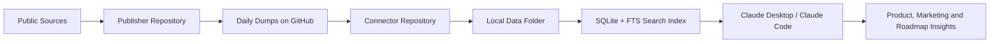

# Reddit Product Insights Project Context and File Guide

This document explains the full project in one place: what the system is meant to do, how the architecture works, what data it collects, how the daily dumps are structured, how Claude uses the data, and what each important file/folder is responsible for.

The system is split into two repositories:

- `reddit-scraper-github-publisher` — collects public data and publishes daily dumps.
- `reddit-insights-claude-agent` — pulls those dumps, stores them locally, indexes them, and exposes insights through Claude Desktop / Claude Code.

## 1. Project Purpose

The main purpose of this project is to convert public user discussions into useful product and marketing intelligence for Nubra.

It helps answer questions like:

- What are retail traders discussing right now?
- What are API/algo users asking for?
- Which product features are repeatedly requested?
- Which Nubra features already exist but users are not aware of?
- Which upcoming Nubra features match real market demand?
- What are competitors offering?
- What topics can be used for webinars, SEO pages, product explainers, lead magnets, and campaign planning?
- What product roadmap signals can be derived from public conversations?

The important idea is that evidence collection is separated from AI reasoning.

The scraper/publisher collects and stores structured public evidence. Claude then uses the connector to retrieve that evidence and generate analysis at query time.

## 2. High-Level Architecture



The system has three main layers:

1. Scraping / collection layer
2. Data processing / storage layer
3. Insights / intelligence layer

## 3. Scraping and Collection Layer

This layer lives mainly in the publisher repo:

```text
C:\Users\suboth sundar\Downloads\reddit_scraper_github_publisher
```

Its job is to collect public discussions and product signals from approved sources.

### 3.1 Current Sources

| Source | Status | What is collected | Why it matters |
|---|---:|---|---|
| Reddit | Implemented | Posts, comments, scores, discussion text | Strongest source for trader pain points and feature requests |
| YouTube | Implemented | Video titles, descriptions, stats, comments | Useful for retail trader education demand and comments-based pain points |
| GitHub | Implemented | Repo/issues/search signals | Useful for API, SDK, algo, automation and developer demand |
| Hacker News | Implemented | Developer/product discussions | Useful for API/platform/developer infra context |
| Broker/product pages | Implemented | Public competitor/product pages | Helps compare what other brokers/platforms are offering |
| Broker-owned communities | Implemented | Public forum topics/replies from Zerodha, Dhan, Upstox, Angel One and FYERS | Direct competitor-user pain points, feature requests and support gaps |
| Manual web research | Implemented | Curated public research rows | Used when a source is hard to automate or when richer research is needed |
| SEO keyword list | Implemented | Marketing search keywords | Used for SEO/content opportunity analysis |
| Nubra feature catalog | Implemented | Existing/upcoming Nubra features | Used to avoid wrong conclusions like “missing” when Nubra already has it |

### 3.2 Sources Not Fully Automated Yet

| Source | Current status | Notes |
|---|---|---|
| Twitter/X | Not automated | Can be done through manual/indexed search first; direct API/scraping has restrictions |
| Telegram | Not automated | Needs public/authorized groups only |
| Discord | Not automated | Needs public/authorized servers only |
| App Store / Play Store reviews | Not automated yet | Useful for app UX feedback and retail pain points |

## 4. Reddit Coverage

The current Reddit channels are configured in:

```text
reddit_scraper_github_publisher/config/channels.json
```

Current configured communities:

- `IndiaInvestments`
- `IndianStreetBets`
- `IndianStockMarket`
- `IndiaAlgoTrading`
- `DalalStreetTalks`
- `NSEbets`
- `IndiaOptionsSelling`

These are independent public Reddit communities. Broker-owned communities are not directly ingested yet.

## 5. Publisher Repository

Local path:

```text
C:\Users\suboth sundar\Downloads\reddit_scraper_github_publisher
```

GitHub:

```text
https://github.com/subothsundar123/reddit-scraper-github-publisher
```

This repository is responsible for:

- collecting data;
- normalizing data into a common structure;
- hashing authors/usernames;
- classifying topics, features, personas, competitors and signal type;
- creating daily dump folders;
- compressing dump files;
- writing summaries and manifests;
- validating checksums;
- publishing data to GitHub.

## 6. Publisher Repository File Guide

### 6.1 Root Files

| File | Purpose |
|---|---|
| `.env.example` | Template showing environment variables like Reddit credentials, YouTube API key and GitHub token |
| `.gitattributes` | Git behavior for tracked files |
| `.gitignore` | Prevents local/secret/generated files from being committed |
| `README.md` | Basic setup and usage instructions |
| `ARCHITECTURE.md` | Publisher-side architecture documentation |
| `pyproject.toml` | Python project config, dependencies and command entrypoints |

### 6.2 GitHub Actions

```text
.github/workflows/daily-collection.yml
```

This file runs the automated daily collection job on GitHub.

It:

- checks out the repo;
- installs Python;
- runs the publisher daily command;
- creates/updates the daily dump;
- validates files;
- commits and pushes the generated data.

The publisher uses India business timezone logic so the dump date matches the intended India date, not UTC date.

### 6.3 Config Folder

```text
config/
```

| File | Purpose |
|---|---|
| `channels.json` | Reddit subreddits, listing types, limits and Reddit search config |
| `public_signal_sources.json` | GitHub, Hacker News, broker docs and YouTube source settings |
| `youtube_keywords.json` | YouTube retail/API keyword partitions and limits |
| `retail_feature_keywords.json` | Nubra retail feature keywords, personas and feature search seeds |
| `web_research_queries.json` | Query bank for manual public web research |

This folder controls what the scraper looks for.

### 6.4 Daily Dumps

```text
daily-dumps/YYYY-MM-DD/
```

Each date folder stores that day’s collected data.

Example:

```text
daily-dumps/2026-07-01/
```

Files inside each dump:

| File | Purpose |
|---|---|
| `posts.jsonl.gz` | Compressed Reddit-style post records |
| `comments.jsonl.gz` | Compressed Reddit comment records |
| `signals.jsonl.gz` | Compressed cross-channel signals from YouTube, GitHub, HN, docs, broker communities and manual research |
| `summary.json` | Counts and high-level source summary |
| `manifest.json` | File size and SHA-256 checksum details |

### 6.5 Why `.jsonl.gz` Is Used

The dump files use:

```text
JSONL + Gzip
```

JSONL means each line is one JSON record:

```json
{"id":"post_1","title":"Need better option chain filters","score":20}
{"id":"post_2","title":"API websocket issue","score":15}
```

Gzip compresses this text into a smaller `.gz` file.

This format is used because:

- it is much smaller than plain JSON;
- it can be read line by line;
- it handles large datasets better than one huge JSON array;
- it supports nested fields better than CSV;
- it is easy to import into SQLite;
- it is standard for data pipelines.

### 6.6 Manifests

```text
manifests/all_dumps.json
```

This is the global dump index. The connector reads this file to know:

- which dump dates exist;
- which files belong to each date;
- what needs to be downloaded;
- what has already been imported.

### 6.7 Manual Research

```text
manual-research/
```

| File | Purpose |
|---|---|
| `README.md` | Explains the manual enrichment workflow |
| `daily-research-prompt.md` | Prompt/instructions for collecting manual public research |
| `output-template.jsonl` | Required format for manual research rows |
| `research-checklist.md` | Quality checklist for manual research |
| `source-query-bank.json` | Search queries for manual research |

This is used when the user asks for “manual web research” or “dump today’s social media data”.

### 6.8 Marketing Keywords

```text
marketing-keywords/
```

| File | Purpose |
|---|---|
| `current.json` | Machine-readable SEO keyword catalog |
| `manifest.json` | Checksum manifest for keyword catalog |
| `README.md` | GitHub-readable keyword overview |
| `views/` | Markdown keyword views split by cluster/type |

This data helps Claude answer SEO/content questions like:

- Which keywords should Nubra target?
- What content pages can be built?
- Which search terms connect to current product features?
- Which keyword themes overlap with community demand?

### 6.9 Product Catalog

```text
product-catalog/
```

| File | Purpose |
|---|---|
| `current.json` | Main Nubra feature catalog |
| `retail-upcoming-features.json` | Structured list of upcoming Nubra retail features |
| `retail-upcoming-features.md` | Human-readable upcoming feature list |
| `manifest.json` | Checksum manifest |
| `history/` | Older versions of the feature catalog |
| `CONTRIBUTING.md` | Rules for updating catalog safely |

This catalog is critical because it prevents Claude from giving shallow answers.

Example:

If users are asking for option chain filters, Claude can check the catalog and say:

- whether Nubra already has it;
- whether it is upcoming;
- whether it is partial;
- whether it needs better visibility/marketing.

### 6.10 Schemas

```text
schemas/
```

| File | Purpose |
|---|---|
| `dump-manifest.schema.json` | Defines valid structure for dump manifests |
| `feature-catalog.schema.json` | Defines valid structure for Nubra feature catalog |
| `public-signal.schema.json` | Defines valid structure for cross-channel signal records |

These files keep the data contract stable.

### 6.11 Scripts

```text
scripts/install_daily_task.ps1
```

This installs a Windows scheduled task for local daily data collection.

### 6.12 Source Code

```text
src/insights_publisher/
```

| File | Purpose |
|---|---|
| `cli.py` | Main implementation: collectors, normalizer, packager, validator and publisher |
| `__init__.py` | Package init/version support |

The installed command is:

```text
insights-publisher
```

Important commands:

| Command | Purpose |
|---|---|
| `collect` | Collect Reddit data |
| `collect-signals` | Collect public signals from GitHub, HN, docs, YouTube and broker communities |
| `collect-youtube` | Collect YouTube text/comments |
| `collect-communities` | Collect broker-owned public community forum topics/replies |
| `package` | Package staged data into a daily dump |
| `add-manual-research` | Merge manual research into a date dump |
| `validate` | Verify file checksums |
| `publish` | Commit and optionally push generated files |
| `daily` | Run the full daily workflow |

### 6.13 Tools

```text
tools/
```

| File | Purpose |
|---|---|
| `seed_catalog.py` | Seeds initial product catalog |
| `update_retail_features_20260701.py` | Updates retail upcoming feature catalog |
| `export_marketing_keywords_markdown.py` | Converts SEO JSON into GitHub-readable Markdown |

### 6.14 Tests

```text
tests/test_publisher.py
```

This validates important publisher behavior:

- dump packaging;
- manifest generation;
- checksum validation;
- signal normalization;
- YouTube planning;
- retail feature mapping;
- SEO keyword export.

## 7. Connector Repository

Local path:

```text
C:\Users\suboth sundar\Downloads\reddit_insights_claude_agent
```

GitHub:

```text
https://github.com/subothsundar123/reddit-insights-claude-agent
```

This repository is responsible for:

- pulling daily dumps from the publisher repo;
- verifying checksums;
- storing data locally;
- importing posts/comments/signals into SQLite;
- building full-text search;
- exposing MCP tools to Claude Desktop;
- exposing slash commands to Claude Code;
- generating structured product/marketing insights.

## 8. Connector Repository File Guide

### 8.1 Root Files

| File | Purpose |
|---|---|
| `.env.example` | Example connector environment variables |
| `.gitignore` | Prevents local/generated files from being committed |
| `.mcp.json` | MCP config for Claude Code |
| `README.md` | User setup and usage instructions |
| `ARCHITECTURE.md` | Full end-to-end system architecture |
| `CLAUDE.md` | Claude Code project behavior/context |
| `LINUX_SETUP_PROMPT.md` | Short setup prompt for Linux users |
| `UPDATE_CONNECTOR.md` | Short prompt/instructions for updating connector |
| `install.sh` | Mac/Linux install script |
| `install.command` | macOS double-click installer |
| `setup-code.sh` | Claude Code setup helper |
| `pyproject.toml` | Python package config and command entrypoints |

### 8.2 Claude Commands

```text
.claude/commands/
```

These are Claude Code slash commands. They are not raw data sources. They are instruction files that tell Claude how to use the connector tools and structure the answer.

Important commands:

| File | Slash command | Purpose |
|---|---|---|
| `daily-insights.md` | `/daily-insights` | Main daily product insights report |
| `new-feature-analysis.md` | `/new-feature-analysis` | Upcoming Nubra retail feature analysis |
| `seo-insights.md` | `/seo-insights` | SEO keyword and content opportunity analysis |
| `youtube-insights.md` | `/youtube-insights` | YouTube-specific insights |
| `api-insights.md` | `/api-insights` | API/algo user insights |
| `retail-insights.md` | `/retail-insights` | Retail trader insights |
| `feature-demand.md` | `/feature-demand` | Most requested features |
| `existing-capabilities.md` | `/existing-capabilities` | Features users ask for that Nubra already has |
| `awareness-gaps.md` | `/awareness-gaps` | Where Nubra has capability but users may not know |
| `competitor-insights.md` | `/competitor-insights` | Competitor positioning and comparison |
| `lead-magnets.md` | `/lead-magnets` | Lead magnet ideas from user problems |
| `webinar-ideas.md` | `/webinar-ideas` | Webinar topics from community demand |
| `product-roadmap.md` | `/product-roadmap` | Roadmap signals |
| `evidence.md` | `/evidence` | Pull supporting evidence |
| `status.md` | `/status` | Connector/data health check |
| `update-insights-data.md` | `/update-insights-data` | Pull latest dumps |
| `update-connector.md` | `/update-connector` | Update connector code/prompts |

### 8.3 Claude Agent Definition

```text
.claude/agents/product-insights-analyst.md
```

This file defines the analysis style and behavior for product-insights work.

It helps Claude answer like someone doing product/market analysis rather than just summarizing text.

### 8.4 Config

```text
config/claude_desktop_config.example.json
```

This shows how the connector should be added to Claude Desktop MCP config.

### 8.5 Context

```text
context/nubra-app-context.md
```

This contains Nubra app/build context. It helps Claude understand:

- retail app flows;
- app modes;
- feature surfaces;
- upcoming app behavior;
- where product capabilities fit.

### 8.6 Desktop Prompts

```text
desktop/
```

| File | Purpose |
|---|---|
| `DAILY_INSIGHTS_PROMPT.md` | Claude Desktop prompt for daily insights |
| `INSIGHTS_REPORT_EXAMPLE.md` | Example output style and report tone |

### 8.7 Prompt Library

```text
prompts/prompt-library.md
```

Central library of reusable prompt patterns.

### 8.8 Scripts

```text
scripts/
```

| File | Purpose |
|---|---|
| `configure_claude_desktop.py` | Adds/updates connector in Claude Desktop config |
| `diagnose.py` | Checks install/data/MCP health |
| `install.ps1` | Windows install script |
| `install_claude_desktop.ps1` | Windows Claude Desktop setup |
| `setup_claude_code.py` | Sets up Claude Code slash commands/launcher |
| `setup_unix.py` | Linux/macOS setup |
| `refresh-data.sh` | Pull latest data on Unix systems |
| `update_local_data.ps1` | Pull latest data on Windows |

### 8.9 Core Source Code

```text
src/reddit_insights_agent/
```

| File | Purpose |
|---|---|
| `core.py` | Main engine: sync, checksum verification, SQLite import, FTS search, analysis, catalog reconciliation |
| `server.py` | MCP server exposed to Claude Desktop / Claude Code |
| `cli.py` | Terminal interface for sync/status/ask/daily-insights |
| `__init__.py` | Package init/version |

### 8.10 Updates

```text
updates/
```

| File | Purpose |
|---|---|
| `latest.md` | Latest update instruction used by update flow |
| `README.md` | Explains update system |
| dated update files | History of major connector changes |

This lets the user run a small update prompt instead of manually knowing every command.

### 8.11 Tests

```text
tests/
```

| File | Purpose |
|---|---|
| `test_flow.py` | Tests sync, import, analysis and connector behavior |
| `test_installer.py` | Tests installer/setup behavior |

## 9. Local Data Storage on User Machine

When the connector runs, it stores data locally in:

```text
~/Documents/Nubra Product Insights
```

Typical structure:

```text
Nubra Product Insights/
├── .data-repo-cache/
├── .data-repo-zip/
├── raw/daily-dumps/
├── catalog/current.json
├── marketing-keywords/current.json
├── cache/
├── insights.sqlite3
└── sync-state.json
```

| File/Folder | Purpose |
|---|---|
| `.data-repo-cache/` | Git-based cached copy of the publisher repo |
| `.data-repo-zip/` | ZIP fallback when Git is unavailable |
| `raw/daily-dumps/` | Verified local copies of daily dumps |
| `catalog/current.json` | Local Nubra feature catalog |
| `marketing-keywords/current.json` | Local SEO keyword catalog |
| `cache/` | Cached analysis data |
| `insights.sqlite3` | Local searchable evidence database |
| `sync-state.json` | Tracks imported dumps and sync status |

## 10. Connector Sync Flow

When Claude asks for insights, the connector:

1. Checks whether local data is fresh.
2. If stale, pulls new dump metadata from GitHub.
3. Downloads only new/missing dumps.
4. Verifies file checksums using manifests.
5. Imports new data into SQLite.
6. Builds/updates the full-text search index.
7. Loads product catalog and SEO catalog.
8. Returns structured evidence to Claude.

The connector can work with:

- Git clone/fetch;
- public GitHub ZIP fallback;
- local publisher repo path for development.

## 11. SQLite and Search Layer

The connector stores imported data in SQLite.

Main tables:

| Table | Purpose |
|---|---|
| `dumps` | Imported dump dates |
| `posts` | Reddit posts and cross-channel signals |
| `comments` | Reddit comments |
| `features` | Nubra feature catalog |
| `evidence_fts` | Full-text search index |

Cross-channel signals are imported into the same evidence model so Claude can search across Reddit, YouTube, GitHub, HN, broker docs, broker communities and manual research together.

## 12. MCP Tools Exposed to Claude

The connector exposes tools through:

```text
src/reddit_insights_agent/server.py
```

Important tools:

| Tool | Purpose |
|---|---|
| `run_daily_insights` | Full structured product insights analysis |
| `ask_product_insights` | Question-specific insights |
| `get_connector_status` | Connector version, counts and health |
| `refresh_insights_data` | Force latest data sync |
| `search_evidence` | Search local evidence |
| `get_nubra_feature` | Look up Nubra feature status |
| `get_nubra_app_context` | Pull app context |
| `get_retail_upcoming_features` | Pull upcoming retail features |
| `get_seo_keywords` | Pull SEO keyword data |
| `compare_insight_periods` | Compare recent vs older topic trends |

## 13. How Claude Uses the Connector

Claude does not automatically “know” the dumps unless:

- the connector is enabled;
- Claude calls a connector tool;
- the prompt/slash command tells Claude to use the connector.

When it uses the connector, Claude can combine:

- dump evidence;
- product catalog;
- upcoming feature list;
- SEO keywords;
- Nubra app context;
- web reasoning if the user allows/general prompt asks for it.

## 14. Current Product Intelligence Capabilities

The system currently supports:

- retail trader insights;
- API/algo user insights;
- most requested features;
- hot discussion topics;
- upcoming feature validation;
- existing capability awareness gaps;
- competitor comparison;
- webinar topics;
- lead magnet ideas;
- SEO/content opportunities;
- YouTube comments and video demand;
- product roadmap signals;
- evidence-backed answers;
- daily/period comparison.

## 15. Upcoming Nubra Feature Context

The product catalog includes upcoming retail features such as:

- larger watchlists;
- OMS presets;
- best fill price;
- instant withdrawal;
- instant fund addition;
- auto-refresh watchlist;
- query-based AI scans;
- trading personas;
- OI trader mode;
- option buyer mode;
- option seller mode;
- investor mode;
- flexible brokerage;
- chart analyser;
- scalper mode;
- one-click mode;
- strategy-level portfolios;
- PnL-based SL/TP;
- quantity by amount or margin;
- 40+ built strategies;
- iceberg order modes;
- no price restriction;
- risk-reward SL/TP;
- technical alerts;
- option-chain alerts;
- strategy-level SL/TP;
- strategy-level time-series plots;
- bid-ask on option chain;
- option-chain filters and saved modes;
- GTT and AMO;
- flexible order modification;
- bid-ask on chart;
- call view and put view;
- payoff and analysis surfaced directly.

Claude can use this list to compare upcoming Nubra features against public market demand.

## 16. Where the Project Can Be Improved Next

Important next improvements:

1. Add app-store/play-store review collection.
2. Add indexed Twitter/X research.
3. Add public Telegram/Discord ingestion only where allowed.
4. Store feature IDs/personas/intent as dedicated SQLite columns.
5. Add recurring time-series metrics for repeated items.
6. Add collection-health dashboard.
7. Add evidence-quality weighting.
8. Add near-duplicate detection.
9. Add source-diversity scoring.

## 17. Broker-Owned Community Scraping Gap

The scraper now includes independent Reddit communities, public searches and broker-owned public communities.

High-value public communities to consider:

- Zerodha TradingQnA
- Dhan MadeForTrade
- Upstox Community
- Angel One SmartAPI Forum
- FYERS Community

These provide useful competitor-side signals:

- user complaints;
- feature requests;
- support gaps;
- API issues;
- order execution problems;
- option chain expectations;
- margin/order type questions;
- platform usability issues.

Current implementation:

- source adapter: `collect_community_signals`;
- config: `config/community_sources.json`;
- Discourse JSON collection for Zerodha, Dhan and Upstox;
- NodeBB public API collection for Angel One SmartAPI Forum;
- sitemap/HTML fallback for FYERS;
- normalized rows are stored in `signals.jsonl.gz`;
- rows are tagged as `source=community_forum`;
- each row carries broker name, category/tags where available, replies, views/likes/upvotes where available, source method and evidence quality.

## 18. One-Line Explanation for Stakeholders

This project collects public trading/product conversations every day, stores them as versioned GitHub data dumps, lets Claude pull and index them locally, and then uses Nubra’s feature catalog plus community evidence to generate product, marketing, SEO, webinar, competitor and roadmap insights.

## 19. Developer Mental Model

Think of the system like this:

```text
Publisher = data factory
GitHub dumps = shared evidence warehouse
Connector = local intelligence engine
Claude commands = user-facing analysis workflows
```

The publisher should stay focused on collecting clean evidence.

The connector should stay focused on making that evidence searchable and usable.

Claude should stay focused on synthesizing product insights from that evidence.
